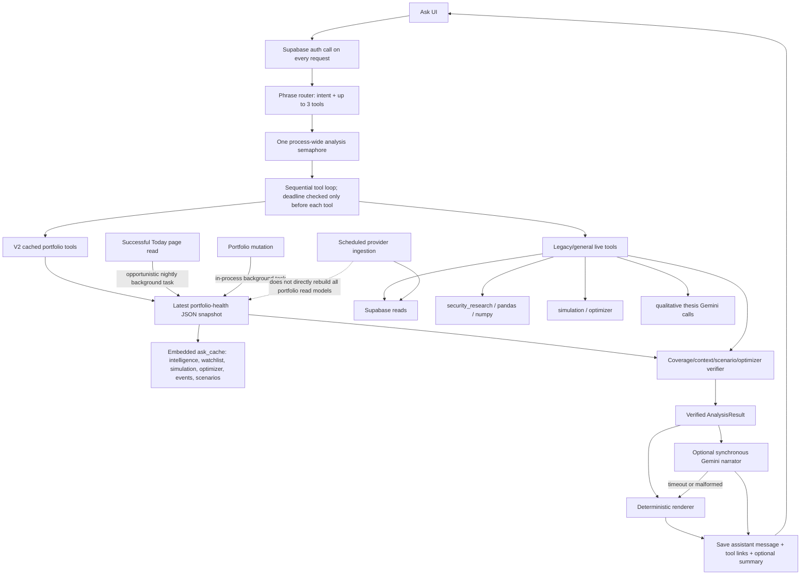
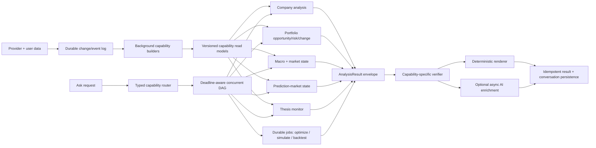

# EagleEyes backend analytical-surface audit

Date: 2026-08-20
Scope: `InvestmentDashboard` backend, Ask execution, analytical domains, storage, caching, rendering, and operational controls
Method: read-only code trace, saved Ask-15 production/diagnostic artifacts, and focused local tests. No refactor, deployment, commit, or push was performed.

## Executive conclusion

EagleEyes does not primarily have a “15 broken questions” problem. It has two analytical architectures occupying the same request surface:

1. A newer snapshot-backed Ask path answers the 15 acceptance intents from a persisted `portfolio_health_snapshot.ask_cache` and has deterministic renderers.
2. An older/general path still performs company research, thesis evaluation, simulation, comparison, macro assembly, and portfolio research synchronously inside the HTTP request.

The snapshot path is the correct direction, but its snapshot is a large, loosely versioned document rather than a set of capability read models. It is refreshed after portfolio mutations and opportunistically after a successful Today read, not after every upstream data refresh. Its top-level `as_of` is the calculation time, which can hide stale component evidence. Coverage is commonly attached as “all current symbols” even when analytical fields are missing. The sequential executor checks the overall deadline only between tools; a tool can exceed it, cannot be cancelled, and blocks the single process-wide analysis slot. Gemini is now optional for the 15 v2 intents, but it remains inside thesis-monitor tool execution and is still required to make several general intents useful.

The saved 2026-08-19 acceptance review is the strongest production evidence available: routing was 15/15, but only 4 questions were useful, 5 were partial, and 6 failed the requested contract or a prerequisite. All 15 production-time Gemini attempts fell back. The current code closes some concrete issues (all three scenario phrases parse, owned watchlist names are reclassified, infeasible outputs are scrubbed, and deterministic rendering is default), but it does not yet close the systemic causes.

**Release verdict: do not claim the 15-question suite is production-ready.** Build one versioned analytical-result contract, materialized read models per capability, a deadline-aware execution DAG, durable job handling for heavy work, and capability-level observability before further question-specific fixes.

## A. Capability map

| Capability family | Current implementation | Read/write model | Ask path | Current maturity |
|---|---|---|---|---|
| Opportunity ranking | `portfolio_overview.build_portfolio_overview`; cached holding health; `ask_portfolio` composer | Portfolio-health JSON snapshot | Cached | Partial: ranking is holding health, not expected opportunity/risk-adjusted return |
| Portfolio risk | `portfolio_diagnostics`; `portfolio_intelligence` | Snapshot `ask_cache.portfolio_intelligence` | Cached for v2; direct calculator for legacy | Useful with gaps: ETF look-through and classification coverage are incomplete |
| Comparison/replacement | `research_comparison_payload`; watchlist research; saved theses | Snapshot watchlist rows plus live thesis reads | Cached for acceptance question; direct research for company comparison | Partial: no canonical incumbent-vs-candidate comparison object |
| Change detection | `portfolio_overview` nightly delta; `evidence`; thesis review events | Portfolio-health history and evidence snapshots | Cached for portfolio; live reads for company/thesis | Partial: baseline absence and “no change” remain easy to conflate |
| Valuation/fundamentals/momentum | `analysis.security_research`; portfolio overview component scores | Raw security/fundamental/price/news tables, rankings file, snapshot rows | Cached for acceptance; live for company paths | Broad but semantically weak where placeholder/default scores participate |
| Scenario analysis | Scenario parser; cached simulation; deterministic scenario/regime outputs | Scenario snapshots and simulation runs | Cached in v2; live simulation in legacy path | Partial: factor parser is broader than the simulation factor model |
| Event monitoring | Today briefing, market events, earnings intelligence, forecasting | Briefing snapshots and provider tables | Cached event list for v2 | Partial: event categories and coverage are not a single complete calendar contract |
| Data quality/confidence | Component coverage, provider health, portfolio-health confidence | Mixed across research rows and snapshots | Cached | Partial: record count, symbol coverage, weighted coverage, and field coverage are inconsistent |
| Thesis invalidation | Versioned theses, assumptions/factors/breakers, thesis monitor | Thesis tables, evidence baselines, review events | Cached thesis existence for v2; synchronous evaluation elsewhere | Strong domain model, unreliable interactive execution when qualitative Gemini calls run |
| Optimization/rebalancing | `analysis.analyze`; builders; simulation optimizer | Analysis runs, builder runs | Latest saved analysis in acceptance path | Partial: no first-class feasibility/constraint contract shared by every optimizer |
| Counter-thesis analysis | Cached risk/factor evidence and deterministic prose | No dedicated countercase read model | Cached | Partial: it is assembled from available risks, not a stable adversarial-analysis capability |
| New-cash allocation | Watchlist queue and cached optimizer context | Snapshot watchlist research, latest analysis | Cached | Weak: no explicit cash hurdle, sizing, liquidity, tax, or turnover comparison |
| Macro/market regime | Macro dashboard, regimes, market context, monitoring | Macro observations, regime labels, briefing snapshots | General evidence/forecast paths only | Not integrated into a unified Ask analytical contract |
| Prediction markets | `forecasting`, `scenarios`, calibration monitoring | Prediction observations, scenario history, user forecasts | Direct stored-data query or cached briefing subset | Useful without live network, but relevance/calibration coverage is incomplete |
| Simulation | Block bootstrap and robust weight alternatives | Persisted completed simulation runs | Cached for v2; synchronous in legacy portfolio tool | Good engine, unsuitable as an interactive synchronous dependency |
| Backtesting | Model-portfolio common-history backtest; validation modules | Mostly response-only plus model-validation storage | No Ask tool | Isolated capability; synchronous endpoint, no durable job/failure record |
| Decision journal | Decisions, immutable context snapshots, retrospectives, patterns | Durable decision and snapshot tables | Direct stored reads | Useful; not normalized into the same result envelope as other tools |

### Existing cross-cutting infrastructure

- **Routing/orchestration:** `backend/ask_orchestration.py`; phrase-scored intents; maximum 3 tools; zero replans/retries; nominal 10-second tool budget.
- **Verification:** `backend/ask_runtime.py`; request-scoped portfolio fingerprint, coverage gates, scenario mapping checks, candidate types, optimizer sanitization.
- **Deterministic rendering:** `backend/ask_portfolio.py` plus `_deterministic_chat_answer` and `_chat_narration_fallback` in `backend/main.py`.
- **Gemini:** `backend/chat.py`; optional final narrator, plus qualitative thesis classification and thesis prose helpers.
- **Caching:** persisted portfolio/briefing/scenario/analysis/simulation snapshots; short-lived in-process TTL caches for evidence, company research, and thesis monitor.
- **Persistence:** Supabase/Postgres production path and SQLite fallback; conversations and tool links are durable; most operational metrics are not.
- **Observability:** request middleware, in-process metrics deque, provider-health report, optional Sentry, structured request logs.

## B. Question → capability → dependency matrix

| # | Capability | Router/tool | Primary dependencies | Deterministic utility | Present blocker |
|---:|---|---|---|---|---|
| 1 | Opportunity ranking | `OPPORTUNITY_RANKING` → `portfolio_overview` | Current portfolio-health snapshot | YES | “Opportunity” is a health-score ordering; freshness and confidence are not eligibility gates |
| 2 | Thesis + replacement | `THESIS_REPLACEMENT` → `thesis_replacement` | Snapshot holdings/watchlist + saved theses | PARTIAL | No result without saved theses; no formal replacement dominance calculation |
| 3 | Change detection | `PORTFOLIO_CHANGE` → `portfolio_change` | Current and prior nightly snapshots | PARTIAL | Snapshot creation is opportunistic; missing baseline is not a first-class result state everywhere |
| 4 | Relative valuation | `VALUATION_RANKING` → `valuation_ranking` | Cached factor scores | YES | Low valuation support is not measured overvaluation relative to growth |
| 5 | Hidden risk | `HIDDEN_RISK` → `portfolio_intelligence` | Weights, classifications, 1,300 prices, dependency rules | YES | ETF look-through and unmapped classifications make hidden overlap incomplete |
| 6 | Multi-factor scenario | `MULTI_SCENARIO` → `portfolio_scenario` | Cached simulation + scenario parser/mapping | PARTIAL | AI-capex factor has no cached simulation mapping; cached run may represent different requested conditions |
| 7 | Watchlist comparison | `WATCHLIST_COMPARISON` → `watchlist_comparison` | Cached watchlist research + holding health | PARTIAL | Orders candidates but does not calculate risk-adjusted dominance versus incumbents |
| 8 | Event monitoring | `PORTFOLIO_EVENTS` → `portfolio_events` | Cached Today events | PARTIAL | Completeness across earnings, macro, and catalysts is not measured |
| 9 | Data quality | `DATA_QUALITY` → `data_quality` | Cached holding rows/provider coverage | YES | Request coverage can be 100% while factor data is missing; placeholder scores remain rankable |
| 10 | Score attribution | `SCORE_ATTRIBUTION` → `score_attribution` | Current/prior nightly holding rows + page ticker | PARTIAL | Explains current components when component deltas/baseline are absent |
| 11 | Thesis invalidation | `THESIS_INVALIDATION` → cached `thesis_monitor` view | Saved theses and explicit breakers | PARTIAL | Correctly refuses to invent; useful only after user-authored thesis prerequisites |
| 12 | Optimization | `PORTFOLIO_ANALYSIS` → `portfolio_analysis` | Latest saved analysis, constraints, holdings | PARTIAL | Taxes are estimated without lots; stale analysis/context compatibility is inferred, not guaranteed |
| 13 | Multifactor screen | `MULTIFACTOR_SCREEN` → `multifactor_screen` | Cached component levels | YES | “Improving” is not evaluated as a trend; defaults can enter the screen |
| 14 | Countercase | `RECOMMENDATION_COUNTERCASE` → cached countercase | Top health row + risk/concentration warnings | YES | No stable recommendation identity or dedicated counter-thesis calculation |
| 15 | Cash allocation | `CASH_ALLOCATION` → `cash_allocation` | Cached watchlist/holdings, profile, latest optimizer | PARTIAL | No cash-yield hurdle, sizing, or net-of-tax/turnover comparison |

## C. Domain map

| Domain | Sources | Deterministic calculations | Historical state | Ask integration | Missing architectural boundary |
|---|---|---|---|---|---|
| Company | securities, fundamentals, prices, news, transcripts, company markets | research factors, valuation, momentum, earnings intelligence | point-in-time evidence and raw observations | Company research, comparison, earnings, score attribution | Versioned `CompanyAnalysisResult` with field-level lineage/freshness |
| Portfolio | holdings, profiles, goals, policies, theses, transactions | diagnostics, health, concentration, covariance, guidance, optimizer | health snapshots, analyses, ledger | Broadest Ask coverage | Capability-specific read models instead of one embedded JSON cache |
| Macro | FRED/ALFRED observations, economic calendar | factor dashboard, regime labels, similarities | vintage-aware observations and regime history | Generic evidence and scenarios | `MacroStateResult` consumed consistently by Ask and simulations |
| Market state | price/index/sector observations, Today briefing | movement context, regimes, attention | briefing snapshots, monitoring runs | Today and generic evidence | Separate observed state from forecast state with a shared timestamp contract |
| Prediction markets | Kalshi, Polymarket, user forecasts | quality, canonical exposure mapping, calibration | observation and scenario history | Forecast tool and cached event subsets | Per-capability availability/coverage, not global “markets present” |
| Scenarios | parsed factors, prediction probabilities, empirical regime returns | canonical conditions and portfolio scenario outcomes | scenario snapshots | Cached scenario tool | Explicit factor registry and composable factor-to-asset sensitivity model |
| Simulation | adjusted returns, macro vintages, profile/goals | block bootstrap, path outcomes, robust weights | completed simulation runs | Legacy synchronous and v2 cached | Durable queued job with progress, terminal failures, and input fingerprint |
| Backtesting | adjusted price history, strategy weights, benchmarks | common-history returns/drawdowns/robustness | validation records; model-portfolio response itself not persisted | No Ask path | Durable backtest run model and asynchronous executor |
| Historical/change | evidence baselines, portfolio snapshots, thesis versions/reviews, decisions | deltas, materiality, retrospective | Good but fragmented across tables | Several specialized paths | Common `ChangeSet`/baseline semantics across every domain |

## D. Current architecture diagram

### Representative execution traces

**Q1 — strongest opportunities**

`POST /api/chat/messages` → remote auth → `build_plan(OPPORTUNITY_RANKING)` → load selected portfolio/context → sequential executor → `ask_portfolio.run(portfolio_overview)` → latest portfolio-health snapshot → rank cached `health_score` → attach request coverage → verify context/freshness/coverage → `AnalysisResult` → deterministic composer (Gemini only if explicitly enabled) → save assistant message/tool links/summary.

There is no current-question research calculation. Correctness is bounded by snapshot freshness, definition of holding health, and whether the snapshot covers the current portfolio.

**Q6 — rates + recession + AI slowdown**

Router → cached `portfolio_scenario` → latest completed simulation embedded in health snapshot → parser produces three independent factors → verifier compares requested factors with the cached run's supported scenario fields → rates/recession may match; AI capex cannot → partial verification → deterministic limitation response → persistence.

This path correctly avoids a synchronous simulation but cannot answer the requested scenario until a matching scenario read model exists.

**General company comparison**

Router → `company_comparison` → ticker resolution with repeated security-master reads → `security_research(tickers)` → database security bundle + rankings + pandas calculations → `research_comparison_payload` → tool summary retains only tickers/method/missing while full comparison is a separate evidence row → verification → deterministic renderer if one exists, otherwise Gemini/fallback → persistence.

**Saved-thesis status**

Router → `thesis_monitor` → evidence change/history queries → each qualitative assumption/factor may invoke Gemini, up to six calls → tool result → optional final Gemini narration → persistence. The outer 10-second budget cannot stop a running classifier call or the rest of the tool.

## E. Ranked systemic failure list

1. **No canonical analytical result contract.** Tool results use ad hoc `summary` shapes and status vocabularies. Coverage, freshness, lineage, feasibility, prerequisites, and partial errors are not enforced at the type boundary.
2. **Two execution models share one Ask surface.** Cached v2 intents are fast and deterministic; legacy/general intents still run expensive analysis and AI synchronously. Reliability therefore depends on wording, not just capability.
3. **Snapshot invalidation is not dependency-driven.** Scheduled ingestion updates raw data but does not rebuild every affected user's read models. Portfolio-health refresh is triggered by portfolio writes or a successful Today read. Ask can serve an old snapshot after newer fundamentals, prices, macro, events, or thesis state arrive.
4. **Freshness is cosmetically current.** Portfolio overview sets `as_of` to calculation time. The verifier checks that top-level time, not the oldest/required component evidence, so stale inputs can pass as a fresh tool.
5. **Coverage can be overstated.** `attach_coverage` defaults evaluated symbols to the entire request context. Cached rows are also reconstructed for every current holding even when analytical fields are absent. Symbol presence is mistaken for usable factor coverage.
6. **The deadline is cooperative but not enforceable.** The tool loop is sequential and only checks elapsed time before a tool. DB, pandas, simulation, optimizer, network, or Gemini work can exceed the budget. Python threads were removed because they could not be cancelled, but no cancellable worker/job boundary replaced them.
7. **One global analysis slot creates head-of-line blocking.** A slow live tool or qualitative thesis evaluation blocks unrelated Ask analysis. Waiting requests can consume their whole budget before starting.
8. **Heavy work remains interactive.** General evidence, company research/comparison, research ranking, benchmark outlook, exit review, portfolio intelligence, simulation, model comparison/optimization, and backtest can load broad histories and perform pandas/numpy/scipy work synchronously.
9. **Lossy transformations change semantics.** Tool summaries omit rich results; generic evidence selects 12 securities and 18 evidence rows; verified evidence keeps only eight extra rows; prompt bounding caps dictionaries/strings/lists; conversation memory retains topics and tool labels rather than conclusions, coverage, versions, and baselines.
10. **Partial failure is local, not capability-aware.** Tool exceptions are isolated, but the verifier does not know which dependencies are required versus optional for each capability. One success can coexist with a required failure without a typed completeness decision.
11. **Persistence occurs after expensive computation and is not atomic.** The user message is saved before tools; the assistant message and artifact links are saved later in separate operations. A late DB failure can leave an orphan user turn or recompute expensive work on retry.
12. **Operational telemetry is process-local and misleadingly aggregate.** Most metrics live in a deque and vanish on restart. Percentiles ignore tags, so there is no per-capability/tool latency view. Structured logs omit deadline remaining and dependency-level timings. `cache_hit` is hard-coded `true` in Ask context.
13. **Documentation/runtime drift exists.** The latency endpoint says five tools and a 24-second overall budget; the actual router permits three tools and clamps the tool budget to at most 20 seconds, default 10.
14. **Backtesting and simulations lack durable failure state.** Completed simulations persist, but a failed run is not created first and transitioned to failed. Model-portfolio backtests return synchronously and are not persisted as jobs.
15. **A large monolithic API module increases coupling.** `backend/main.py` contains routing adapters, analytical calls, rendering, persistence, and endpoints. This is not merely style: it makes it easy for a “read” tool to start heavy calculations or AI without a capability contract.

### Large synchronous operations reachable from interactive requests

| Interactive path | Retrieves/calculates | Duplicate/sequential behavior | Latency risk | Read-model replacement |
|---|---|---|---|---|
| Generic `stored_evidence` | portfolios/profile, up to 12 security histories, macro factors, scenarios, analysis | Sequential assembly; overlaps portfolio snapshot and research reads | Seconds; DB/pandas bound | General evidence manifest keyed by question entities and versions |
| Company research | security master resolution, 260 price rows/ticker, fundamentals, news, markets, factor calculations | Repeated resolver DB calls; research assembled synchronously | Subsecond to several seconds depending DB/load | `company_analysis_current` per ticker |
| Company comparison | full research for all tickers plus portfolio lookup | Recomputes company rows already materializable | Seconds | `company_comparison` from current company read models |
| Research ranking | 260 prices for every holding + search payload | Repeats portfolio overview research | Grows with holdings | Materialized holding/candidate ranking |
| Benchmark outlook | all holdings + SPY research | Repeats security research for portfolio | Grows with holdings | Portfolio benchmark-outlook read model |
| Exit/replacement legacy path | all holdings research, theses, latest optimizer | Duplicate portfolio and research reads | High for large portfolios | Replacement/candidate comparison read model |
| Direct portfolio intelligence | 1,300 prices/ticker, diagnostics, theses, forecasts, events | Some futures, then aggregate calculation | High memory and seconds/tens of seconds | Versioned portfolio-risk snapshot |
| Thesis monitor | evidence history plus up to six Gemini calls | Qualitative calls are sequential | Up to many multiples of Gemini timeout | Background thesis-monitor evaluation |
| Legacy Ask simulation | up to 1,260 prices/ticker, macro, fund data, 300–500 paths, robust optimizer | CPU loops and DB reads in request | High; can exceed tool budget | Queued simulation run selected by exact input fingerprint |
| Model portfolio compare/optimize | multiple optimizers, some threaded | Parallel CPU/DB inside synchronous endpoint | Memory/CPU spikes | Durable optimization job |
| Model portfolio backtest | up to 10,000 bars/symbol, pandas pivot/resample/common panel | One large synchronous dataframe path | High for broad baskets | Durable backtest job with stored result/failure |
| Cold portfolio overview | 1,300 prices for holdings, research, diagnostics, guidance, then 260 prices for watchlist | Holdings and watchlist research are sequential; repeated provider-status/profile/history reads | Seconds/tens; first GET blocks if no snapshot | Background dependency-driven materialization only |

## F. Latency breakdown

### Observed evidence

The saved production-timeout baseline on 2026-08-19 shows cached acceptance tools at roughly **0.64–1.60 seconds** (one saved optimizer read was ~0.004 seconds), Gemini narration at roughly **7.05 seconds**, and total wall time around **10.2–11.2 seconds** for the sampled responses. All 15 Gemini attempts fell back at the production timeout.

With the diagnostic timeout, successful Gemini narration took roughly **10.4–23.9 seconds**; several fallbacks consumed **16–25.7 seconds** of narration, and total requests reached **19–29.5 seconds**. When Gemini was intentionally skipped because verification was partial, direct local request totals were roughly **3.1–4.0 seconds**, with tools at **0.64–1.36 seconds**. Current default deterministic rendering should remove most narration latency, but a new production distribution has not been persisted.

### Component budget assessment

| Component | Current behavior | Measured/estimated | Audit assessment |
|---|---|---:|---|
| Routing | In-process phrase scoring | <10 ms estimated | Not a concern; correctness is |
| Authentication | Remote Supabase user lookup every request; curl fallback after HTTP failure | Up to 8 s, then up to 10 s fallback | Unbudgeted critical-path dependency |
| DB reads | Multiple independent connections/queries per tool and persistence stage | Cached tools observed ~0.6–1.6 s including their DB work | Needs query spans and connection reuse |
| Company research | Security bundle + rankings + pandas per ticker | Subsecond to several seconds; unmeasured in production by capability | Must be materialized for portfolio-scale queries |
| Portfolio calculations | Snapshot read for v2; cold overview loads 1,300 bars/ticker | Read is fast; cold path can be seconds/tens | Cold calculation must never happen on Ask |
| Macro | Stored observation queries in general evidence | Usually DB-bound; no component metric | Materialize macro state |
| Prediction markets | Stored queries; network refresh outside most reads | DB-bound; build joins can fan out | Add capability timing/coverage |
| Historical | Portfolio/evidence history queries | DB-bound; fragmented | Add baseline lookup timing and state |
| Scenario | Snapshot read in v2 | Fast but often not matching requested factors | Latency solved at cost of correctness |
| Optimizer | Saved result in acceptance path; live elsewhere | ~0.004 s read; live unbounded | Queue live optimizer |
| Simulation | Live in legacy path, cached in v2 | CPU/DB heavy; no production span | Queue and persist terminal state |
| Backtest | Synchronous endpoint | Dataframe size grows with symbols/history | Queue and persist |
| Gemini | Optional final narration; also hidden inside thesis tools | 7 s production timeout; 10–24 s successful diagnostics | Never run inside analytical tool path |
| Persistence | User message, assistant message, tool links, optional summary | Several sequential DB writes; unmeasured | Use idempotent request/result transaction or outbox |

The current overall tool budget is not a latency SLO. A single call can exceed it, auth is outside it, narration is outside it, and persistence is outside it.

## G. Gemini dependency analysis

| Capability | Without Gemini | Reason |
|---|---|---|
| Acceptance opportunity/valuation/multifactor rankings | YES | Deterministic rows and composers exist |
| Hidden portfolio risk | YES | Deterministic concentration/correlation/dependency renderer exists |
| Portfolio change and score attribution | PARTIAL | Deterministic, but missing baselines/deltas limit the conclusion |
| Watchlist/replacement/new cash | PARTIAL | Deterministic queue exists; requested comparison/allocation math does not |
| Scenario | PARTIAL | Deterministic parser/verifier exists; factor mapping is incomplete |
| Rebalancing | PARTIAL | Saved deterministic optimizer can be shown only when compatible/feasible; narrative cannot repair missing tax lots |
| Thesis invalidation | PARTIAL | Structured thresholds work; qualitative assumptions become `INSUFFICIENT_EVIDENCE` without a classifier |
| Live thesis monitoring | PARTIAL | Deterministic items work; qualitative items currently call Gemini inside the tool |
| Company research | PARTIAL | Structured facts are useful; no complete deterministic company-research composer for every question |
| Company comparison | PARTIAL | Calculation exists; the tool summary is lossy and final usefulness often depends on narration |
| Macro/market state | PARTIAL | Structured data exists; generic Ask synthesis depends on a renderer |
| Prediction markets | PARTIAL | Probabilities/mappings are useful; cross-market explanation depends on renderer |
| Decision journal | PARTIAL | Snapshots/patterns are useful; open-ended retrospective synthesis benefits from narration |
| Simulation | YES | Engine outputs structured outcomes and warnings |
| Backtesting | YES | Metrics/curves/assumptions are deterministic |
| Generic open-ended Ask | NO/PARTIAL | Fallback often reports tool availability rather than answering the analytical question |

Gemini should be an asynchronous or optional presentation enhancer after a complete deterministic result. Qualitative thesis classification is a separate model-derived analytical dependency and must be named, versioned, cached, deadline-isolated, and allowed to return `UNAVAILABLE` independently of final narration.

## H. Recommended target architecture

### Required contracts

Every capability should return one envelope with:

- `capability`, `schema_version`, `calculation_version`, `input_fingerprint`;
- `status`: `SUCCESS | PARTIAL | UNAVAILABLE | FAILED | PENDING`;
- `data` containing the full typed analytical result, not a prose-oriented summary;
- `coverage`: requested/evaluated entities plus required-field and portfolio-weight coverage;
- `freshness`: calculated time, effective-through time, and oldest required input;
- `lineage`: dataset/provider/version per claim group;
- `dependencies`: per-dependency status, latency, freshness, optional/required flag, and error class;
- `limitations`, `warnings`, `prerequisites`, and `verification`;
- `job` reference for heavy work;
- no attempted recommendations when feasibility or required coverage fails.

### Execution rules

1. Router maps to reusable capabilities, not handlers named after questions.
2. Read-only capability nodes execute concurrently when independent.
3. Each node receives an absolute deadline and must use DB statement/network timeouts derived from remaining time.
4. CPU-heavy and non-cancellable work runs in a separate worker process as a durable job.
5. Partial results are assembled only from successful nodes; required dependency failure is decided by the capability verifier.
6. Ask never refreshes providers or builds broad research synchronously.
7. Read-model builders are triggered by data-version events and portfolio/thesis/decision changes, with periodic reconciliation.
8. A result is served only if its input fingerprint matches the request context or it is explicitly labeled stale/incompatible.
9. Deterministic rendering is mandatory for every release-gated capability. AI enrichment may arrive later without changing calculations.
10. Conversation persistence is idempotent by request ID; tool/result artifacts are linked through an outbox or transaction.

## I. Implementation phases

### Phase 0 — Freeze and measure (1 week)

- Freeze new question-specific handlers.
- Define capability names and the `AnalysisResult` envelope.
- Persist per-request, per-node spans with request ID, dependency, duration, deadline remaining, coverage, freshness, cache state, and Gemini status.
- Re-run the 15-question suite with Gemini disabled and preserve results as the baseline.

### Phase 1 — Read-model foundation (2–3 weeks)

- Split the monolithic portfolio-health `ask_cache` into versioned read models: opportunity, risk, changes, events, data quality, watchlist comparison, score attribution, thesis status, scenarios, and optimization compatibility.
- Track upstream dataset versions and effective-through timestamps.
- Trigger rebuilds after ingestion, portfolio/thesis/profile/decision changes, and a reconciliation schedule.
- Keep the existing snapshot as a compatibility adapter during migration.

### Phase 2 — Typed Ask executor (2 weeks)

- Replace the sequential tool loop with a bounded concurrent DAG for read nodes.
- Add absolute deadlines and per-node budgets.
- Encode required versus optional dependencies per capability.
- Make verification capability-specific; remove default “all symbols evaluated” coverage.
- Make persistence idempotent and resilient to late failures.

### Phase 3 — Close the acceptance capability gaps (2–4 weeks)

- Define opportunity versus holding-health semantics.
- Build candidate-vs-incumbent and cash-hurdle comparisons.
- Add field-level data-quality eligibility rules; exclude placeholder scores from measured rankings.
- Add factor trends for “improving” fundamentals.
- Add stable recommendation identity and structured countercase.
- Require exact scenario-run compatibility and add AI-capex sensitivity or explicitly mark it unsupported.
- Require optimizer input-fingerprint compatibility, feasibility, and tax-lot coverage before actionable rebalance output.

### Phase 4 — Heavy analytical jobs (2–3 weeks)

- Move simulation, optimization, backtesting, broad portfolio rebuilds, and qualitative thesis monitoring into workers.
- Persist `QUEUED/RUNNING/SUCCESS/PARTIAL/FAILED/CANCELLED/EXPIRED` states before work begins.
- Add deduplication by input fingerprint, progress, retry policy, and terminal error artifacts.
- Ask returns the latest compatible completed run or a job reference, never an unbounded calculation.

### Phase 5 — Broader domain unification (3–5 weeks)

- Add company, macro, market-state, prediction-market, and historical change read models to the same envelope.
- Normalize probability type and calibration metadata.
- Build cross-domain scenario composition from an explicit factor registry.
- Add Ask capabilities for simulation and backtesting that retrieve durable results.

### Phase 6 — AI presentation and operational hardening (1–2 weeks)

- Keep deterministic answers as the synchronous response.
- Run AI enrichment asynchronously or inside a small remaining-time budget.
- Version model-derived qualitative classifications separately from narration.
- Add load, chaos, restart, stale-data, and job-recovery tests.

## J. Release gate

Release only when all conditions below pass in a production-like environment.

### Functional gate

- All 15 questions route correctly and return the expected typed capability.
- All 15 provide a useful deterministic response with Gemini disabled. A legitimate missing user prerequisite may return `UNAVAILABLE`, but it must identify the exact prerequisite and must not be counted as analytical success.
- No result labels a health score as an opportunity forecast, a low valuation score as proven overvaluation, a confidence score as probability, or a placeholder as measured evidence.
- Scenario answers prove exact compatibility for every requested factor.
- Rebalance/new-cash outputs prove feasibility, current-context fingerprint, turnover treatment, tax-lot coverage state, and cash-hurdle comparison.
- Current holdings cannot appear as new/replacement candidates.

### Failure/chaos gate

For every major capability, automated tests inject: one node failure, missing holdings, Gemini timeout, macro outage, prediction-market outage, missing history, infeasible optimizer, unmapped scenario factor, and failed backtest job. The response must preserve successful evidence, mark required gaps, avoid invented conclusions, and reach a terminal state.

### Latency and capacity gate

- Cached/read-model Ask: p50 ≤ 2 s, p95 ≤ 5 s, p99 ≤ 8 s including auth and persistence.
- No provider refresh, broad research calculation, optimizer, simulation, backtest, or qualitative model loop on the synchronous Ask path.
- Queue wait and job runtime have separate SLOs.
- Load test demonstrates no head-of-line blocking across unrelated users/capabilities.

### Freshness/coverage gate

- Every answer exposes calculated-at, effective-through, oldest-required-input, and input fingerprint.
- Required-field coverage and portfolio-weight coverage meet capability-specific thresholds.
- Ingestion events rebuild or invalidate all affected read models within a declared freshness SLO.
- A process restart cannot erase the latest operational state or leave runs permanently nonterminal.

### Observability gate

Production telemetry must answer, by request ID: routed capability, node/dependency status, exception class, node and total elapsed time, deadline remaining at start/end, cache/read-model version, entity/field/weight coverage, input freshness, partial-result decision, Gemini classifier/narrator status, persistence status, and final verification outcome.

### Test evidence from this audit

- Focused Ask/runtime/chat/cache tests: **33 passed**.
- Broader selected backend set: **112 passed, 1 failed**. The failure is the deterministic “worst holding” wording contract (`test_worst_holding_answer_focuses_on_weakest_evidence_not_a_sell_call`). This is not the central architectural blocker, but the release suite is not fully green.
- No live provider, production database, deployment, mutation, or full Ask-15 rerun was performed in this audit.

## Evidence index

- Ask router and limits: `backend/ask_orchestration.py:9-156`
- Request-scoped context, verification, and sanitization: `backend/ask_runtime.py:22-343`
- Cached acceptance tools and deterministic portfolio composer: `backend/ask_portfolio.py:18-422`
- Snapshot construction and embedded Ask cache: `backend/main.py:717-826`
- Live Ask tool registry and sequential executor: `backend/main.py:3652-3799`
- Chat request, verification, Gemini fallback, and persistence: `backend/main.py:3846-4151`
- Generic evidence bounding: `backend/chat.py:29-80,125-221`
- Synchronous thesis AI classifier: `backend/main.py:1283-1294,2690-2725`
- Synchronous simulation in legacy Ask: `backend/main.py:2801-2863`
- Synchronous model-portfolio backtest: `backend/model_portfolios.py:120-183`
- Process-local metrics: `backend/operational_monitoring.py:12-59`
- Per-request remote authentication: `backend/auth.py:25-72`
- Saved acceptance evidence: `artifacts/ask-15-app-timeout-baseline.json`, `artifacts/ask-15-local-gemini-evaluation.json`, and `artifacts/ask-15-quality-review.md`
